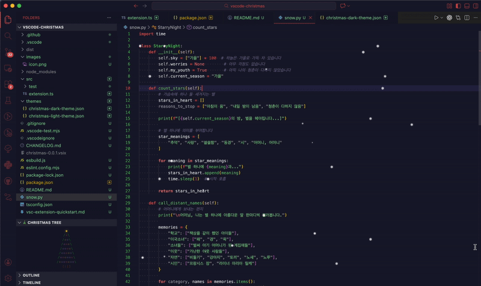

# 🎄 Christmas VS Code Extension

A festive VS Code extension that brings the holiday spirit to your coding environment with snow effects, an animated ASCII Christmas tree simulator, and a beautiful Christmas-themed color scheme.

## Features

### ❄️ Snow Effect Toggle
Open a panel with falling snowflakes animation. Toggle it on/off with the command palette.

### 🎄 ASCII Christmas Tree Simulator
An interactive webview panel featuring:
- **Animated ASCII art Christmas tree**
- **Color-changing ornaments** that blink and change randomly
- **Falling snowflakes** in the background
- **Interactive buttons**:
  - Toggle Lights 💡 - Turn ornament animations on/off
  - Change Tree 🌲 - Cycle through different shades of green
  - Toggle Snow ❄️ - Start/stop the snowfall
  - Add Present 🎁 - Add presents under the tree

## Commands

Open the Command Palette (`Cmd+Shift+P` on macOS, `Ctrl+Shift+P` on Windows/Linux) and type:

| Command | Description |
|---------|-------------|
| `Christmas: Toggle Snow Effect ❄️` | Show/hide the snow effect panel |
| `Christmas: Show Christmas Tree 🎄` | Open the ASCII Christmas tree simulator |
| `Christmas: Merry Christmas! 🎅` | Display a festive message |

## Using the Theme

1. Open the Command Palette (`Cmd+Shift+P` or `Ctrl+Shift+P`)
2. Type "Color Theme"
3. Select "Preferences: Color Theme"
4. Choose "Christmas Dark"

## Enjoy! 🎅🎄❄️

Merry Christmas and Happy Coding!
